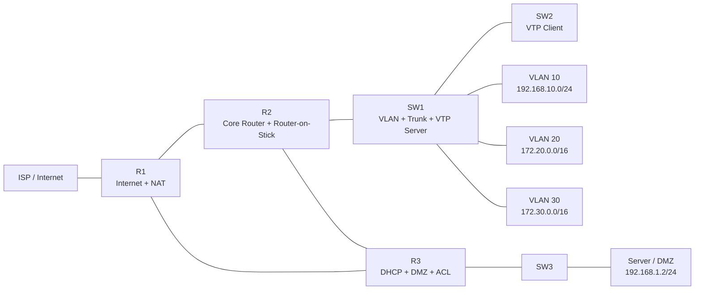
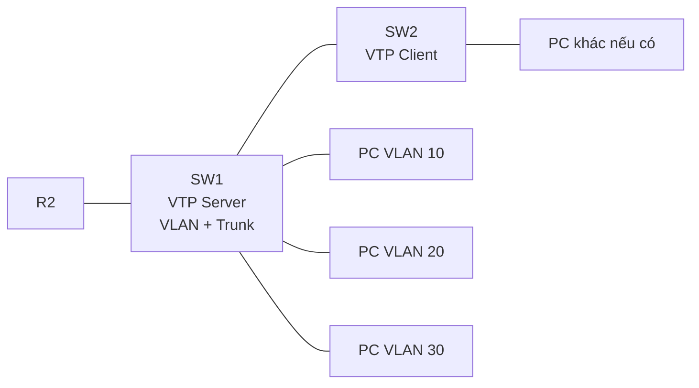
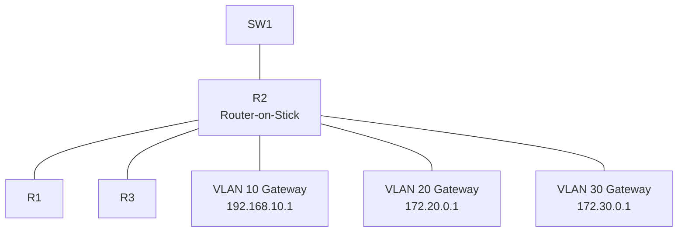
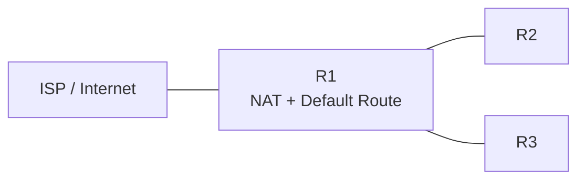
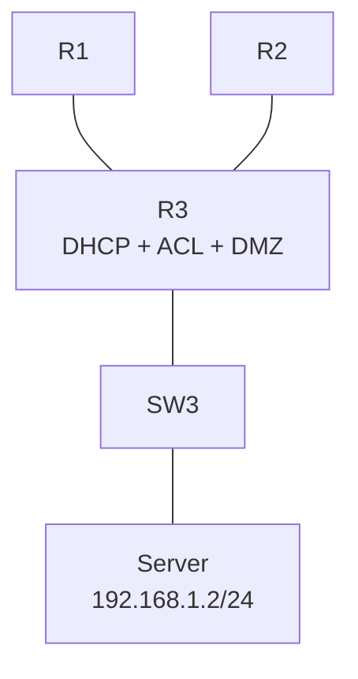

# KẾ HOẠCH TRIỂN KHAI CẤU HÌNH MẠNG  
## Packet Tracer Online — Phân chia công việc cho nhóm 4 người

---

## 1. Thông tin chung

| Nội dung | Chi tiết |
|---|---|
| Môi trường | Cisco Packet Tracer Online |
| Số lượng thành viên | 4 người |
| Mục tiêu | Cấu hình hệ thống mạng theo đề bài, hạn chế xung đột khi làm online |
| Nguyên tắc chính | Mỗi thành viên chỉ cấu hình thiết bị được giao |

---

## 2. Nguyên tắc làm việc trên Packet Tracer Online

Vì bài làm được lưu **online**, mọi thay đổi sẽ được đồng bộ trực tiếp. Do đó, nếu hai người cùng cấu hình một thiết bị, rất dễ xảy ra lỗi:

- Ghi đè cấu hình của nhau
- Mất lệnh vừa cấu hình
- Sai IP, sai route, sai ACL
- Khó xác định ai gây lỗi

> Quy tắc bắt buộc: **Không có 2 thành viên cùng cấu hình một router hoặc switch tại cùng một thời điểm.**

---

## 3. Sơ đồ topology tổng thể



---

## 4. Phân chia thiết bị cho từng thành viên

| Thành viên | Thiết bị được phép cấu hình | Vai trò chính |
|---|---|---|
| Thành viên 1 | SW1, SW2 | VLAN, Trunk, VTP |
| Thành viên 2 | R2 | Router-on-Stick, OSPF, DHCP Relay |
| Thành viên 3 | R1 | Internet, NAT, Default Route, Telnet |
| Thành viên 4 | R3, SW3, Server | DHCP, DMZ, ACL, Server |

---

# 5. Thành viên 1 — SWITCHING TEAM

## 5.1 Thiết bị phụ trách

```text
SW1
SW2
```

## 5.2 Topology phần của Thành viên 1



## 5.3 Công việc cần làm

### Trên SW1

- Đặt hostname
- Tạo VLAN 10, 20, 30, 40, 50
- Gán các port access vào VLAN
- Cấu hình trunk sang SW2
- Cấu hình trunk sang R2
- Cấu hình VTP Server

### Trên SW2

- Đặt hostname
- Cấu hình trunk về SW1
- Cấu hình VTP Client
- Kiểm tra VLAN học được từ SW1

---

## 5.4 Lệnh cấu hình SW1

```bash
enable
configure terminal
hostname SW1
banner motd # NHOM X - SW1 #
```

### Tạo VLAN

```bash
vlan 10
name VLAN10

vlan 20
name VLAN20

vlan 30
name VLAN30

vlan 40
name VLAN40

vlan 50
name VLAN50
```

### Gán port access

```bash
interface range e1/0-3
switchport mode access
switchport access vlan 10

interface range e2/0-3
switchport mode access
switchport access vlan 20

interface range e3/0-3
switchport mode access
switchport access vlan 30
```

### Cấu hình trunk

```bash
interface e0/0
switchport mode trunk

interface e0/1
switchport mode trunk
```

### Cấu hình VTP Server

```bash
vtp domain NHOMX
vtp mode server
vtp password 123
```

---

## 5.5 Lệnh cấu hình SW2

```bash
enable
configure terminal
hostname SW2
banner motd # NHOM X - SW2 #
```

### Trunk về SW1

```bash
interface e0/0
switchport mode trunk
```

### VTP Client

```bash
vtp domain NHOMX
vtp mode client
vtp password 123
```

---

## 5.6 Lệnh kiểm tra

```bash
show vlan brief
show interfaces trunk
show vtp status
```

---

# 6. Thành viên 2 — CORE ROUTER TEAM

## 6.1 Thiết bị phụ trách

```text
R2
```

## 6.2 Topology phần của Thành viên 2



## 6.3 Công việc cần làm

- Cấu hình subinterface cho VLAN 10, 20, 30
- Cấu hình gateway cho các VLAN
- Cấu hình link R2 ↔ R1
- Cấu hình link R2 ↔ R3
- Cấu hình OSPF
- Cấu hình OSPF cost để ưu tiên đường chính
- Cấu hình DHCP Relay cho VLAN 20 và VLAN 30

---

## 6.4 Lệnh cấu hình R2

```bash
enable
configure terminal
hostname R2
banner motd # NHOM X - R2 #
```

### Router-on-Stick

```bash
interface e0/1.10
encapsulation dot1Q 10
ip address 192.168.10.1 255.255.255.0

interface e0/1.20
encapsulation dot1Q 20
ip address 172.20.0.1 255.255.0.0

interface e0/1.30
encapsulation dot1Q 30
ip address 172.30.0.1 255.255.0.0
```

### Bật cổng vật lý nối xuống switch

```bash
interface e0/1
no shutdown
```

### Link R2 ↔ R1

```bash
interface e0/0
ip address 192.168.100.2 255.255.255.252
no shutdown
```

### Link R2 ↔ R3

```bash
interface e0/2
ip address 192.168.100.6 255.255.255.252
no shutdown
```

### OSPF

```bash
router ospf 1
network 192.168.10.0 0.0.0.255 area 0
network 172.20.0.0 0.0.255.255 area 0
network 172.30.0.0 0.0.255.255 area 0
network 192.168.100.0 0.0.0.3 area 0
network 192.168.100.4 0.0.0.3 area 0
```

### Tăng cost đường phụ R2 ↔ R3

```bash
interface e0/2
ip ospf cost 100
```

### DHCP Relay

```bash
interface e0/1.20
ip helper-address 192.168.100.10

interface e0/1.30
ip helper-address 192.168.100.10
```

---

## 6.5 Lệnh kiểm tra

```bash
show ip interface brief
show ip route
show ip ospf neighbor
```

---

# 7. Thành viên 3 — INTERNET & NAT TEAM

## 7.1 Thiết bị phụ trách

```text
R1
```

## 7.2 Topology phần của Thành viên 3



## 7.3 Công việc cần làm

- Cấu hình interface ra ISP
- Nhận IP từ ISP bằng DHCP
- Cấu hình NAT outside
- Cấu hình NAT inside về phía mạng nội bộ
- Cấu hình default route
- Cấu hình OSPF
- Cấu hình NAT overload
- Cấu hình Telnet cơ bản

---

## 7.4 Lệnh cấu hình R1

```bash
enable
configure terminal
hostname R1
banner motd # NHOM X - R1 #
```

### Interface ra ISP

```bash
interface e0/0
ip address dhcp
ip nat outside
no shutdown
```

### Interface về R2

```bash
interface e0/1
ip address 192.168.100.1 255.255.255.252
ip nat inside
no shutdown
```

### Interface về R3

```bash
interface e0/2
ip address 192.168.100.9 255.255.255.252
ip nat inside
no shutdown
```

### Default route

```bash
ip route 0.0.0.0 0.0.0.0 dhcp
```

### OSPF

```bash
router ospf 1
network 192.168.100.0 0.0.0.3 area 0
network 192.168.100.8 0.0.0.3 area 0
default-information originate
```

### NAT Overload

```bash
access-list 1 permit 192.168.10.0 0.0.0.255
access-list 1 permit 172.20.0.0 0.0.255.255

ip nat inside source list 1 interface e0/0 overload
```

### Telnet cơ bản

```bash
username admin secret 123

line vty 0 4
login local
transport input telnet
```

---

## 7.5 Lệnh kiểm tra

```bash
show ip interface brief
show ip route
show ip ospf neighbor
show ip nat translations
ping 8.8.8.8
```

---

# 8. Thành viên 4 — SERVICES & SECURITY TEAM

## 8.1 Thiết bị phụ trách

```text
R3
SW3
Server
```

## 8.2 Topology phần của Thành viên 4



## 8.3 Công việc cần làm

- Cấu hình interface R3
- Cấu hình OSPF trên R3
- Cấu hình DHCP cho VLAN 20
- Cấu hình DHCP cho VLAN 30
- Cấu hình IP cho Server
- Chuẩn bị ACL cho các yêu cầu bảo mật
- Chuẩn bị Static NAT cho Server nếu đề yêu cầu public server

---

## 8.4 Lệnh cấu hình R3

```bash
enable
configure terminal
hostname R3
banner motd # NHOM X - R3 #
```

### Interface về R1

```bash
interface e0/0
ip address 192.168.100.10 255.255.255.252
no shutdown
```

### Interface về R2

```bash
interface e0/3
ip address 192.168.100.5 255.255.255.252
no shutdown
```

### Interface về DMZ / Server

```bash
interface e0/1
ip address 192.168.1.1 255.255.255.0
no shutdown
```

### OSPF

```bash
router ospf 1
network 192.168.100.8 0.0.0.3 area 0
network 192.168.100.4 0.0.0.3 area 0
network 192.168.1.0 0.0.0.255 area 0
```

---

## 8.5 DHCP cho VLAN 20

```bash
ip dhcp pool VLAN20
network 172.20.0.0 255.255.0.0
default-router 172.20.0.1
dns-server 8.8.8.8
```

---

## 8.6 DHCP cho VLAN 30

Yêu cầu PC4 nhận địa chỉ `.40`, vì vậy cần exclude các địa chỉ khác.

```bash
ip dhcp excluded-address 172.30.0.1 172.30.0.39
ip dhcp excluded-address 172.30.0.41 172.30.255.254

ip dhcp pool VLAN30
network 172.30.0.0 255.255.0.0
default-router 172.30.0.1
dns-server 8.8.8.8
```

---

## 8.7 Cấu hình Server

Trên Server cấu hình IP tĩnh:

```text
IP Address      : 192.168.1.2
Subnet Mask     : 255.255.255.0
Default Gateway : 192.168.1.1
DNS Server      : 8.8.8.8
```

---

## 8.8 Lệnh kiểm tra

```bash
show ip interface brief
show ip route
show ip ospf neighbor
show ip dhcp binding
show running-config | section dhcp
```

---

# 9. Các phần nên để ngày hôm sau

Những phần này nên làm sau khi VLAN, OSPF, DHCP, NAT cơ bản đã chạy ổn định.

| Công việc | Người phụ trách | Lý do nên làm sau |
|---|---|---|
| ACL chặn PC4 vào DMZ | Thành viên 4 | Cần DHCP và DMZ hoạt động trước |
| VLAN20 chỉ được truy cập Web Server | Thành viên 4 | Cần Server hoạt động trước |
| Chặn VLAN30 ra Internet | Thành viên 3 | Cần NAT hoạt động trước |
| Telnet chỉ cho VLAN10 | Thành viên 3 | Cần routing ổn định trước |
| Static NAT cho Server | Thành viên 4 hoặc 3 tùy đề | Cần xác định NAT đặt ở R1 hay R3 |

---

# 10. Tiến độ mục tiêu trong hôm nay

## Mục tiêu cần đạt

| Hạng mục | Mức độ hoàn thành hôm nay |
|---|---:|
| VLAN | 100% |
| Trunk | 100% |
| VTP | 100% |
| Router-on-Stick | 100% |
| OSPF | 100% |
| DHCP | 100% |
| NAT Overload | 80–100% |
| ACL | Chuẩn bị, chưa cần hoàn tất |

> Nếu làm đúng phân chia này, nhóm có thể hoàn thành khoảng **60–70% bài trong hôm nay**.

---

# 11. Quy tắc phối hợp khi làm online

## Trước khi cấu hình thiết bị

Mỗi thành viên cần báo trong nhóm:

```text
Mình đang cấu hình R2.
```

## Sau khi cấu hình xong

Báo lại:

```text
R2 đã cấu hình xong, mọi người không sửa R2 nếu chưa báo.
```

## Khi cần người khác thêm lệnh vào thiết bị của họ

Ví dụ Thành viên 4 cần DHCP Relay trên R2, không được tự vào R2. Hãy gửi lệnh cho Thành viên 2:

```bash
interface e0/1.20
ip helper-address 192.168.100.10

interface e0/1.30
ip helper-address 192.168.100.10
```

---

# 12. Những thiết bị không được cấu hình chéo

| Thiết bị | Người duy nhất được cấu hình |
|---|---|
| SW1 | Thành viên 1 |
| SW2 | Thành viên 1 |
| R2 | Thành viên 2 |
| R1 | Thành viên 3 |
| R3 | Thành viên 4 |
| SW3 | Thành viên 4 |
| Server | Thành viên 4 |

---

# 13. Checklist kiểm tra cuối ngày

## Switching

```bash
show vlan brief
show interfaces trunk
show vtp status
```

## Routing

```bash
show ip route
show ip ospf neighbor
```

## DHCP

```bash
show ip dhcp binding
```

## NAT

```bash
show ip nat translations
```

## Test từ PC

| Kiểm tra | Kết quả mong muốn |
|---|---|
| PC VLAN10 ping gateway | Thành công |
| PC VLAN20 nhận DHCP | Thành công |
| PC VLAN30 nhận DHCP | Thành công |
| PC VLAN20 ping Server | Thành công |
| PC VLAN10 ra Internet | Thành công |
| PC VLAN20 ra Internet | Thành công |

---

# 14. Kết luận

Cách chia này phù hợp nhất cho Packet Tracer Online vì:

- Mỗi người sở hữu thiết bị riêng
- Hạn chế tối đa xung đột cấu hình
- Có thể làm song song
- Dễ kiểm tra lỗi
- Có thể hoàn thành hơn 50% nhiệm vụ trong hôm nay

---

# END
